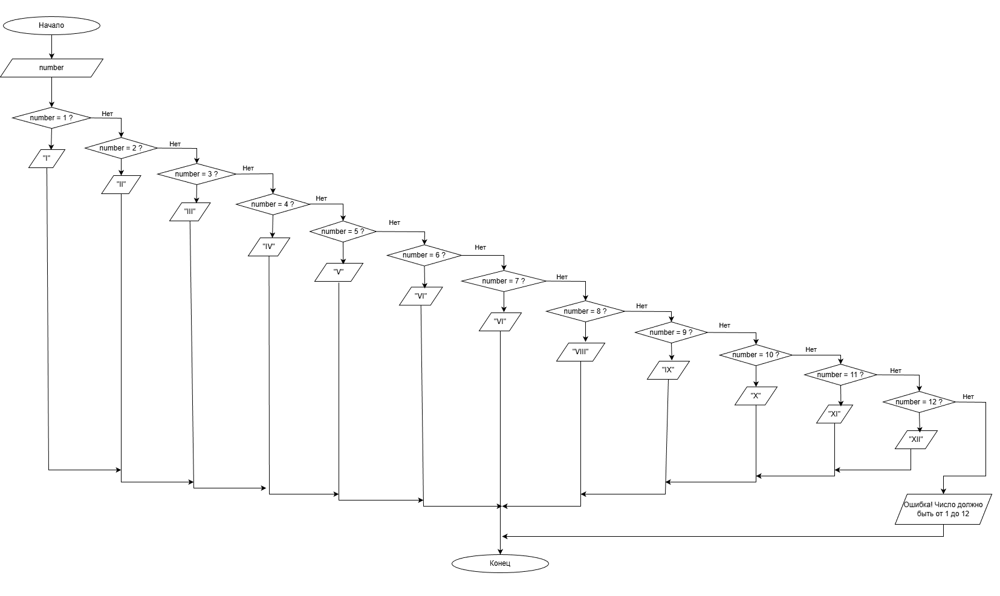

# Домашнее задание к работе 7

## Условие задачи
Составить программу, которая для заданного числа от 1 до 12 выводит его отображение римскими числами.

## 1. Алгоритм и блок-схема

### Алгоритм
1. **Начало**
2. Вывести приглашение для ввода числа
3. Считать целое число от пользователя
4. Проверить введенное число:
   - Если число находится в диапазоне от 1 до 12, вывести соответствующую римскую цифру
   - Если число вне диапазона, вывести сообщение об ошибке
5. Использовать оператор switch для сопоставления чисел:
   - case 1: "I"
   - case 2: "II"
   - case 3: "III"
   - case 4: "IV"
   - case 5: "V"
   - case 6: "VI"
   - case 7: "VII"
   - case 8: "VIII"
   - case 9: "IX"
   - case 10: "X"
   - case 11: "XI"
   - case 12: "XII"
   - default: сообщение об ошибке
6. **Конец**

### Блок-схема


## 2. Реализация программы

```c
#define _CRT_SECURE_NO_WARNINGS
#include <stdio.h>
#include <locale.h>

int main() {
    setlocale(LC_ALL, "");

    int number;

    printf("Введите число от 1 до 12: ");
    scanf("%d", &number);

    printf("Число %d римскими цифрами: ", number);

    switch (number) {
    case 1: printf("I\n"); break;
    case 2: printf("II\n"); break;
    case 3: printf("III\n"); break;
    case 4: printf("IV\n"); break;
    case 5: printf("V\n"); break;
    case 6: printf("VI\n"); break;
    case 7: printf("VII\n"); break;
    case 8: printf("VIII\n"); break;
    case 9: printf("IX\n"); break;
    case 10: printf("X\n"); break;
    case 11: printf("XI\n"); break;
    case 12: printf("XII\n"); break;
    default: printf("Ошибка! Число должно быть от 1 до 12.\n"); break;
    }

    return 0;
}
```

## 3. Результаты работы программы

```
Введите число от 1 до 12: 7
Число 7 римскими цифрами: VII
```

```
Введите число от 1 до 12: 12
Число 12 римскими цифрами: XII
```

## 4. Информация о разработчике

Маркина Елена, бТИИ-251
